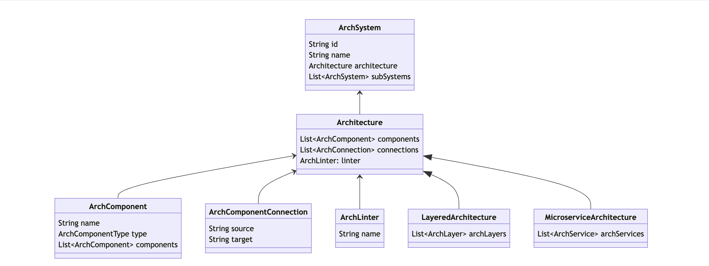
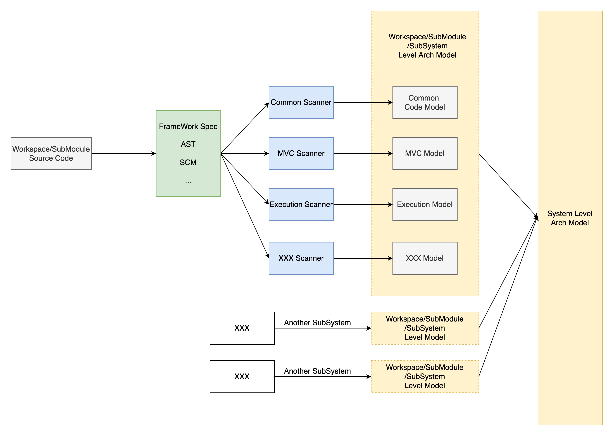
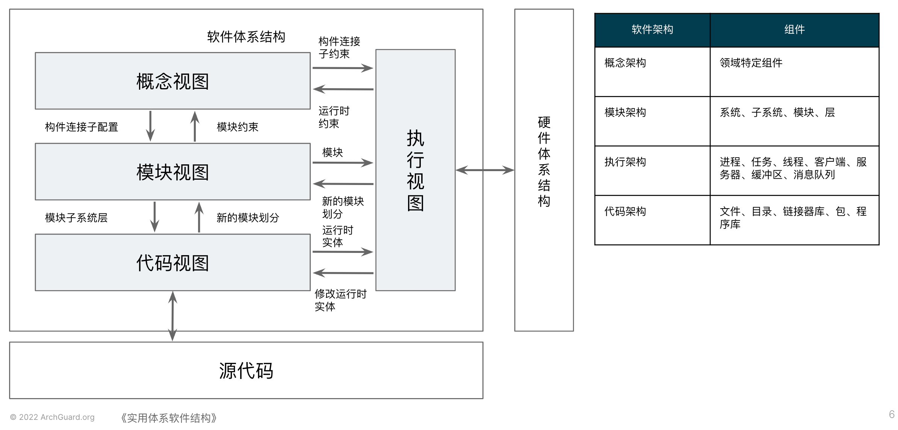
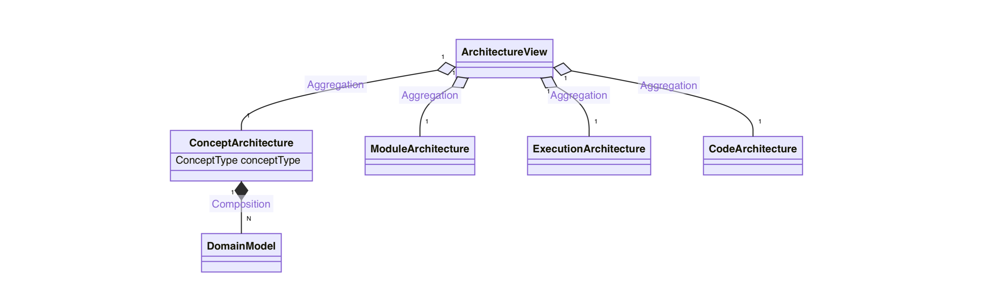
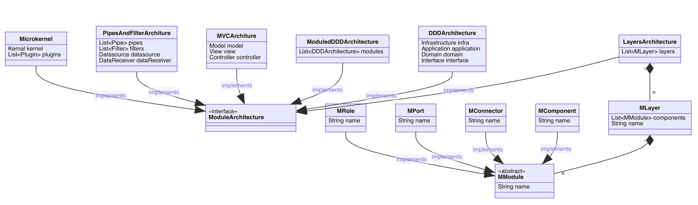
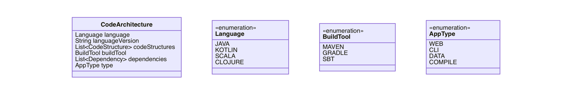

## 为什么要给架构建模？
ArchGuard 作为架构治理平台，“架构”作为核心概念贯穿始终，没有模型，何谈实现。因此，对“架构”这个有些抽象的词汇，我们开始尝试着对它一点点具象开来。
在[为“架构”再建个模：如何用代码描述软件架构?](https://www.phodal.com/blog/architecture-model)中提到为了实现对架构的治理，有两个核心的部分就是架构模型、架构治理模型。这次我们探究的就是“架构模型”这一部分。

## 那么什么是架构？
先来重新看下几个定义:

《软件架构：架构模式、特征及实践指南》一书中 Neal Ford 对于架构的定义：
```
软件架构中包含系统的结构、系统必须支持的架构特征、架构决策以及设计原则。系统的结构是指实现该系统的一种或多种架构风格（如微服务、分层和微内核等）。架构特征定义了系统的成功标准。架构决策定义了一组关于如何构建系统的规则。设计原则是关于如何构建系统的非必须遵循的指导原则。
```

Bob 大叔（Robert C. Martin）的《架构整洁之道》书中的定义：
```
软件系统的质量是由它的构建者所决定的，软件架构这项工作的实质就是规划如何将系统切分成组件，并安排好组件之间的关系，以及组件之间互相通信的方式。
```

在 TOGAF（The Open Group Architecture Framework）中对架构有这么一个定义：
```
Architecture = Structure of Components + Relationships + Principles & Guidelines
```

这样看来，一些模糊的描述，仿佛逐渐清晰了起来。这些定义都有一些共同的部分，比如“组件”，“组件间的关系”，“指导原则”以及对于“架构风格”这个维度的泛化分析。


## 如何为架构建模？
架构是静态的，也是动态的，这个动态体现在架构处于设计到开发的不断演进，也体现在开发到运行的实际work。

这就有了 ArchGuard 的三态架构模型
- 设计态
- 开发态
- 运行态

#### 设计态
设计态是目标架构。目标架构简单来看的话，应当是符合某种特定架构风格的架构，比如分层架构，六边形架构等。
但是，基于现实来看，很难会有某个架构完全符合到标准标准架构风格，基于现实的权衡取舍，会有属于适合与当前状况的适配架构设计。甚至，会有多种架构风格混合使用。

到这里，仿佛有了一点点疑问，我们的目标架构一定要是标准的吗？不标准的架构会不会本身就有问题？

这个我们也思索了很久，但 ArchGuard 作为给架构师的工具，是为架构师服务的，将评判架构好坏的权力交给架构师，ArchGuard 只负责提供基于架构师意愿的最高效好用的效率提升。

所以这里，没有特定的规则，选取了 DSL 的方式，将目标架构设计的自由最大限度的交由架构师。

架构工作台己就绪，DSL 设计进行中，敬请期待！

#### 开发态
开发态对应的实现架构。对于实现架构而言，是对系统现状的展示，从现有系统中分析出当前架构。通过对目标架构和实现架构的对比分析，可以对目标架构的落地进展进行追踪，并且通过对目标架构和实现架构减小偏差，真正实现架构守护。

 

#### 运行态
运行态是体现在 APM、Docker、k8S 等等上的执行时架构。执行架构是对实现架构的补充，进一步验证当前架构的实际运行情况。但是，当我们观测到执行架构时，代码实现已经完成，这时再回过头来改动，成本巨大。所以，这一阶段的架构，更多的充当的是一个监控验证的作用。

#### 贯穿三态，聚焦治理
在整个三态过程中，架构治理的成本逐步增加。在设计态，架构师有足够自由的方式来制定目标架构，在运行态，是对现实情况的反馈监控。因此，ArchGuard 对于架构治理的重点放在了开发态，在可治理的初期就进行介入，守护架构开发的整个流程。

 

 

## 演进中的架构模型
在表述我们（演进中）的架构模型之前，我们先引入架构视图[ASA]的概念：



### 概念体系架构视图

概念体系架构视图与**应用领域**紧密关联。

> 在概念视图中，我们使用“**构件/连接子**”模型来建模。
>
> #### 构件
>
> 构件是独立执行的对等实体，是主要**应用功能**的载体。构件通过端口与外界交互。大多数构件源自需求及应用领域，其他构件可能在支持全局性质时出现。
>
> #### 连接子
>
> **构件通信和控制**由**连接子**来完成，连接子关注控制方面。
>
> [ASA]

#### 领域模型

概念视图关注系统的领域模型，具体体现为系统（子系统）对应的聚合、实体、值对象等领域模型。可以通过UML类图的方式来展示领域模型的结构。


### 模块体系结构视图

> 在模块视图中，所有的**应用功能、控制功能、适应和调节**（对应概念视图中的**构件/连接子**）都要映射到模块。
>
> 模块有两个正交的结构：**分解与层**。系统的分解捕获了系统如何在逻辑上被分解成子系统和模块。模块还会被分配到某一特定的层，该层限制了这一模块与其他模块之间的依赖关系。
>
> #### 模块
>
> 一个模块相当于一个单独的概念元素（构件、端口、连接子或者角色），或者是概念元素的集合。
>
> 模块之间的交互通过接口来进行。
>
> #### 层
>
> 模块会被分配到某一特定的层，层限制了模块间的依赖关系。
>
> [ASA]

如何划分和组织模块往往体现了架构的模式。常见的架构模式有：

- 分层架构
- 管道架构
- 微内核架构
- MVC
- DDD/ModuledDDD
- 微服务架构
- ...

不同的架构模式有着不同的模块划分和组织的方式，可以通过模块体系结构视图表现出来。

### 执行体系结构视图

> 执行视图依据**系统运行时**的平台元素(Plantform Element)来描述系统的结构。包括：操作系统任务、进程、线程、地址空间等。
>
> [ASA]

在系统运行中，不同模块或子系统之间的连接可以被建模成Connection的形式，常见的连接方式有Http, RPC, 依赖注入,共享内存等等。

### 代码体系结构视图

> 代码体系视图与编程语言的具体实现紧密相关。
>
> **源代码构件、中间构件，部署构件**映射到**模块视图和执行视图**中的元素。
>
> [ASA]

代码视图与一个SubModule或者Workspace中的代码实现紧密关联，模块，包，文件的树状组织结构，构建工具，依赖库，AST，打包和部署的形式等都属于代码视图的模型。

## 模式划分原则

> 模式的名称大都基于某一种特定实现之上，但在实践中的运用并不一定完全相同。只要具备了某模式的一些关键特征，我们就可以认为遵循了该模式。
>
> [POSA4]

## 系统级别的架构视图模型实现（演进中）  


## 子系统(Workspace/Module)级别的架构视图模型实现（演进中）
 - 概念体系结构视图

  

 - 模块体系结构视图

  

 - 执行体系结构视图

  

 - 代码体系结构视图

 

## 参考资料
- 《实用体系软件结构》[ASA]
- 《面向模式的软件架构 卷1:模式系统》[POSA1]
- 《面向模式的软件架构 卷4:分布式计算的模式语言》[POSA4]
- 《软件架构：架构模式、特征及实践指南》