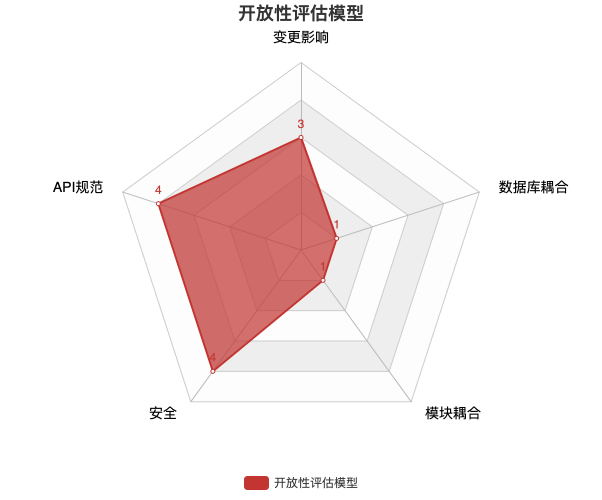

# 评估模型

## 市场响应力评估模型
市场响应力：当市场发生改变时，现有业务为了能够适应市场，业务作出反应的能力

问题场景：
- 系统收集不到业务反馈，不知道业务该怎么走
- 每次新增功能都需要3，5个月才能上线，跟不上竞品更新速度

评估维度：

## 质量评估模型
质量：业务上线后，该业务是否能满足客户期望，有多少严重Bug

问题场景：
- 测试返修率高，总是反复测试才能上线
- 经常出现上线失败，需要紧急修复
- 客户经常投诉，页面错乱，业务出错

评估维度：

## 可用性评估模型
可用性：业务不稳定，访问出错

问题场景：
- 上线无法实现零停机时间
- 经常接到客户投诉，页面打不开了，连接错误

评估维度：

## 开放性评估模型
开放性：当出现出现创新性业务时，原有系统能不能很好的支撑

问题场景：
- 新增线上渠道，系统需要花很长时间改造才能支持新渠道
- 给其他系统提供API，需要花很长时间开发接口

评估维度：

# 评估维度
## 模块耦合
参考文献：

## 变更影响
参考文献：

## 数据库耦合
参考文献：

## 敏捷成熟度
参考文献：

## 基础设施
参考文献：

## 测试保护
参考文献：

## 分层架构
参考文献：
- [《架构整洁之道》](https://book.douban.com/subject/30333919/)
- [The Clean Code Blog](https://blog.cleancoder.com/)
- [软件架构编年史](https://www.jianshu.com/p/b477b2cc6cfa?utm_campaign=maleskine&utm_content=note&utm_medium=seo_notes&utm_source=recommendation)
- [The Software Architecture Chronicles](https://herbertograca.com/2017/07/03/the-software-architecture-chronicles/)

[^_^]:
    ## API规范
    参考文献：

## 代码规范
参考文献：
- [《重构》](https://book.douban.com/subject/4262627/)
- [代码整洁整洁之道](https://book.douban.com/subject/4199741/)
- [Alibaba Java Coding Guidelings](https://yq.aliyun.com/attachment/download/?id=5585)（需登陆阿里云下载）
- [SonarSource Code Smell](https://rules.sonarsource.com/java/type/Code%20Smell)

## 安全
参考文献：
- [SonarQube Security-related Rules](https://docs.sonarqube.org/latest/user-guide/security-rules/)
- [SonarSource Security Hotspot](https://rules.sonarsource.com/java/type/Security%20Hotspot)